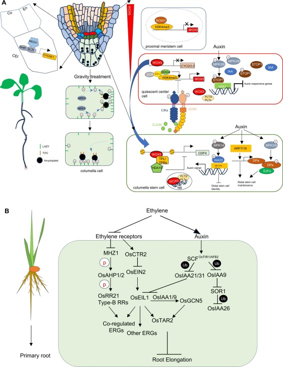

# New work to integrate

Sui, J., Tian, H., Ding, Z., & Kong, X. (2024). Crop Designs: The ideal root architecture for future crop breeding. _New Crops_, 100030. https://doi.org/10.1016/j.ncrops.2024.100030



<figure><figcaption></figcaption></figure>

Henry, A. R., Miller, N. D., & Spalding, E. P. (2023). Patch Track Software for Measuring Kinematic Phenotypes of Arabidopsis Roots Demonstrated on Auxin Transport Mutants. _International Journal of Molecular Sciences_, _24_(22), 16475. https://doi.org/10.3390/ijms242216475



Henry, A. R., Miller, N. D., & Spalding, E. P. (2023). Patch Track Software for Measuring Kinematic Phenotypes of Arabidopsis Roots Demonstrated on Auxin Transport Mutants. _International Journal of Molecular Sciences_, _24_(22), 16475. https://doi.org/10.3390/ijms242216475


